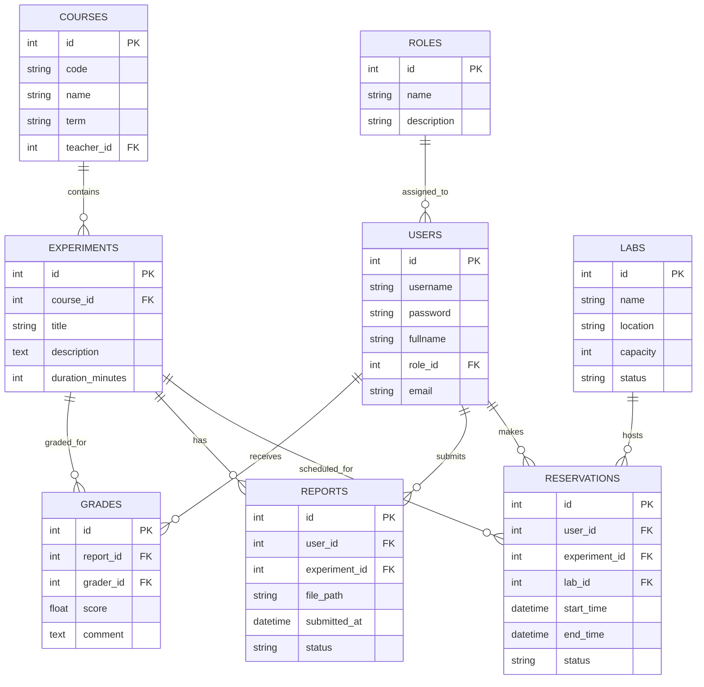

# ER 图（Mermaid）

```mermaid
erDiagram
    USERS ||--o{ RESERVATIONS : makes
    USERS ||--o{ REPORTS : submits
    USERS ||--o{ GRADES : receives
    ROLES ||--o{ USERS : assigned_to
    COURSES ||--o{ EXPERIMENTS : contains
    LABS ||--o{ RESERVATIONS : hosts
    EXPERIMENTS ||--o{ RESERVATIONS : scheduled_for
    EXPERIMENTS ||--o{ REPORTS : has
    EXPERIMENTS ||--o{ GRADES : graded_for

    USERS {
        int id PK
        string username
        string password
        string fullname
        int role_id FK
        string email
    }
    ROLES {
        int id PK
        string name
        string description
    }
    COURSES {
        int id PK
        string code
        string name
        string term
        int teacher_id FK
    }
    EXPERIMENTS {
        int id PK
        int course_id FK
        string title
        text description
        int duration_minutes
    }
    LABS {
        int id PK
        string name
        string location
        int capacity
        string status
    }
    RESERVATIONS {
        int id PK
        int user_id FK
        int experiment_id FK
        int lab_id FK
        datetime start_time
        datetime end_time
        string status
    }
    REPORTS {
        int id PK
        int user_id FK
        int experiment_id FK
        string file_path
        datetime submitted_at
        string status
    }
    GRADES {
        int id PK
        int report_id FK
        int grader_id FK
        float score
        text comment
    }
```

说明：可用 Mermaid 渲染工具查看 ER 图。